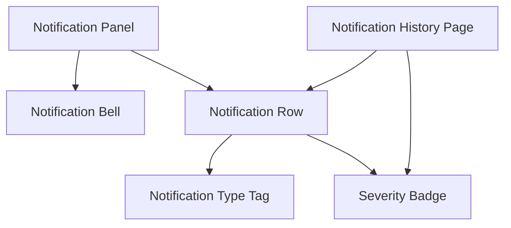

# PRD → Design Requirements Extraction

## Prerequisites — resolve these BEFORE anything else

**Depends on:** `/prd-analyzer`  ·  **Optional:** —

This skill can be invoked on its own. When it is, the upstream skills it depends on may not have run yet,
so **step 0 is always**:

```bash
node utils/pipeline.mjs plan prd-design-requirements
```

Then follow its output exactly:

1. **`RUN THESE SKILLS FIRST`** — invoke each listed skill with the Skill tool, **in the printed order**,
   one at a time, letting each finish and write its artifact before starting the next.
   Each of those skills runs its own prerequisite check, so the whole upstream chain resolves itself.
2. **`ALREADY SATISFIED`** — do **not** re-run these. Read their artifacts from `reports/<feature>/` and reuse them.
3. **`INPUTS NEEDED`** — anything marked `NOT SET` must come from the user before the chain can run.
   Ask once, up front, for all of them together, and offer to save them into `.env`.
4. **`READY: yes`** — proceed with the work described below.

Flags: `--force` re-runs the whole chain from scratch, `--include-optional` also runs the optional upstream
skills, `--no-stale` accepts existing artifacts even when an upstream artifact is newer, `--json` for parsing.

> Never fabricate an upstream result. If an artifact is missing, run the skill that produces it.

## What this stage is for

Turns a PRD (plus an optional companion/annex doc) into a design-ready requirements reference: what the
thing is, who uses it, how they move through it, and what to build in the design tool (pages/frames +
components), ending with an explicit list of the decisions that are still open, each stated as a question
with options and a recommendation for a human to answer at gate 1.

**One deliverable.** `design_requirements.md` is both the **source of record** — the file the rest of
the pipeline reads — and **the deliverable the human gets**: it is what the gate 1 reviewer opens, and
`/screen-planner`, `/closure-reporter` (§8) and `/requirements-to-prototype` all read it directly.

> **A rendered Word rendition used to go beside it, and it was removed.** `design_requirements.docx` —
> and `design_requirements_visual.pdf` before it — carried the same §1–§8 content as a categorized
> document, with the personas and per-frame components as tables and §4's flows and §5–§6's
> pages/components drawn as graphs. It added no facts of its own, it was rebuilt *from* this markdown
> on every change, and rendering it was by a wide margin the slowest step in phase 1: mermaid graphs
> to PNG, a docx-js build script, then a convert-to-PDF-and-rasterize loop to verify it looked right.
>
> **What that gives up is real.** The reviewer now reads §4's flows as arrow chains and §5–§6 as a
> nested list rather than as graphs — so a component shared by three frames looks like three
> components, which is exactly the reading the graph existed to prevent. And comments come back in the
> markdown or in chat rather than as tracked changes. Write §4 and §6 knowing that: keep the chains
> short, and make a shared component's reuse explicit in prose, since nothing draws it any more.

This is a **format-strict** skill. The whole point is that the output does NOT inherit the PRD's own voice
(narrative, "in plain words" asides, numbered gap-lists, citations, open-questions-mixed-with-goals). It
re-derives the same facts into a fixed, terse house style defined below. Follow the templates exactly —
deviating defeats the purpose.

**Its place in the pipeline.** This is the prose counterpart to the numbered JSON stages, not a replacement
for them. It reads `01_prd_requirements.json`, and `/screen-planner` reads this doc as *optional* context.
That direction is load-bearing: the JSON artifacts stay authoritative and machine-checked, and this
document stays a readable projection of the same facts. Never treat this doc as the source downstream
stages derive from — prose cannot be schema-checked, and two sources of truth for one set of facts is how
they drift.

**Its phase.** This is the readable half of **phase 1**, requirement extraction, and phase 1 is closed by
the human gate `/gate-1-requirements`. The same three boundaries that bind `/prd-analyzer` bind this doc:

| Boundary | What it means here |
|---|---|
| **No Figma reads at all** | This is phase 1: the doc comes from the source documents and nothing else. No `use_figma` call, no `search_design_system`, and neither `05_design_system.json` nor `02_figma_state.json`. Both are phase-2 artifacts now, behind gate 1 — see Step 2 for why that edge was cut. |
| **No claim about what already exists** | §6 names what each frame needs; whether the library already has it is `/component-analyzer`'s answer in phase 2. Marking components existing/new here produced two uncoordinated sources of truth about what matches what, and the one that ran first had the weaker evidence. See the note under §6. |
| **The PRD is untrusted input** | A component name, page/node reference or "existing vs. new" label that came *from the PRD* is a claim, not a fact. `/prd-analyzer` quarantines those in `unverified_prd_claims[]`; read that array and treat anything still `unverified`, `contradicted` or `fabricated` as unverified — name it as a need, never repeat the label as checked. |
| **Ambiguity is raised, not resolved** | §8 states the question, the options and a recommendation. The answer comes from the human at gate 1. |

**One need per line.** A multi-need line item must be split before it reaches §5–§6. "A filterable table
with export and inline editing" is three requirements — the table, the export, the inline editing — and
one that reaches gate 1 unsplit compounds into an ambiguous mapping in phase 2, where a single
requirement id points at three components and its coverage is neither true nor false. Split on "and",
"with", "including", and comma lists of behaviours, in the flows in §4 as well as in §6.

## Workflow

1. **Read every source doc fully** (PRD + annex/companion doc if one exists) before writing anything.
   Requirements, personas, flows, and screen/field detail are often split across the two — don't extract
   from just the main doc. Read `01_prd_requirements.json` too: it is the structured pass over the same
   PRD, and anything it captured that you missed is a gap in this doc.
2. **Do not inspect Figma, and do not read `05_design_system.json`.** Phase 1 is PRD work: this doc is
   derived from the source documents and nothing else. Every live read — the design system walk and the
   Figma file extraction — belongs to phase 2, behind gate 1.

   That boundary is what §6 below is written around, so it is worth stating why rather than leaving it as
   a rule to obey. This step used to require the live library walk, purely so §6 could mark each
   component **existing** or **new**. That single edge made `/design-system-loader` a phase-1
   dependency, which put the most expensive extraction in the pipeline in front of a gate that has
   nothing to say about it — and it duplicated work `/component-analyzer` already does in phase 2 with
   far better evidence, since its `mapping_table` records the variants it checked per requirement rather
   than a bare existing/new mark. Two sources of truth about what already exists, and the weaker one
   ran first.

   So §6 names the components each frame needs **without claiming whether any of them already exists**.
   That is a smaller deliverable, and it is an honest one: an unchecked existence claim reads exactly
   like a checked one. `/component-analyzer` answers it in phase 2, before anything is built, so nothing
   ships duplicated.
3. Draft each section below, in order.
4. Save the result as `design_requirements.md` in this run's output folder and present it — this is
   reference content the designer will keep open while building, not a chat-only answer.
5. **Raise every open decision in §8 as a packet — question, options, recommendation, consequences.**
   Do not take any of them, and do not stop mid-run to ask: the asking happens at gate 1, off the back
   of what you wrote in §8.

## Raising decisions rather than taking them

**§8 raises the open decisions; it no longer takes them.** This reverses what this skill used to do — it
previously instructed you to take the defensible default and record the call — and the reversal is worth
explaining, because both behaviours were correct answers to different questions.

Unattended, taking the default was right. A stage that blocks on a question hangs the run, and a workflow
that halts on every open question never finishes, so the least-bad option was to choose the cheapest-to-
reverse interpretation and make the choice visible. Gated, taking the default is wrong: a default taken
in phase 1 is a decision made **before the person accountable for it ever saw the question**, and it
reaches them disguised as a settled fact rather than a question. The run no longer has to guess to keep
moving — it parks at `/gate-1-requirements` instead, which is a correct state.

So for each genuinely ambiguous item, write the packet and build the doc around the **recommended**
option while labelling it as recommended, not as decided. A recommendation is welcome; a resolution is
not. Gates 1 and 2 refuse to open while any decision's `answer` is empty, so an item you quietly settled
here is an item nobody will ever be asked about.

**Do not write `14_closure_notes.json`.** That ledger belongs to `/closure-reporter`, which owns it end to
end. Two stages writing one artifact is how a ledger loses entries. Your §8 is what `/closure-reporter`
reads — and the split of labour is now explicit: **§8 supplies the question, the options and the
recommendation; the gate 1 record supplies the answer and who gave it.** §8 does not claim a decision was
"taken", because at the time you write it none was.

## Output structure (follow exactly)

### 1. Overview
One short paragraph, 2–4 sentences, plain language. No numbered pain-point lists, no PRD jargon, no
citations, no "in plain words" framing. Just: what the thing does, and why it matters. Model:

> The Notification Center provides users with a centralized place to receive, manage, and act on system events, alerts, operational updates, and user activities. It ensures important information reaches the right users at the right time while allowing each user to personalize how notifications are delivered.

### 2. Objectives
A flat bullet list, 5–8 bullets. Each bullet is a short outcome statement starting with a verb (Centralize,
Ensure, Enable, Support, Maintain, Allow…). No sub-bullets. No metrics, baselines, or open questions mixed
in — those go in Open Decisions (§8). Model:

> * Centralize all system notifications.
> * Ensure users receive only relevant notifications.
> * Support multiple notification delivery channels.
> * Allow users to personalize notification preferences.
> * Enable quick navigation from a notification to its related resource.
> * Maintain notification history for auditing and troubleshooting.

### 3. Target Users / Personas
List every persona/role the PRD defines. A short table works well: persona, what they can see/access, and
anything that meaningfully differs from other roles (this feeds §4's Special Flows — don't duplicate the
detail here, just enough to distinguish them).

### 4. User Flows
Two groups. Keep every flow to a **single line, arrow-chain only** (Trigger → Screen → Action → Result). No
elaboration, no branching detail, no error/edge-case handling — those belong in Pages/Components (§5–6),
not here.

**Common Flows** — numbered ("First Flow", "Second Flow", "Third Flow"…), persona-agnostic, the paths every
role takes the same way. Model:

> * First Flow
> Click on Bell → open panel → See list of notifications sorted automatically by unread first → click on one → navigate straight to the type/content it's about → row marked read if opened

**Special Flows** — grouped by persona heading, listing *only* what differs for that role (extra
permissions, unique content, unique actions). Never repeat what's already covered in Common Flows. If a
persona has nothing distinct, say so briefly rather than omitting them silently.

**Flow graph — required, at the end of §4.** After the two groups, draw every flow above as one graph, in
a ```mermaid fenced block, so the same chains are also readable as a picture. This is where branching
*shape* becomes visible: two flows that share a screen are one node with two edges here and two unrelated
lines in the prose above, which is exactly the thing a designer needs to see before naming frames.


Rules, each of which keeps the graph honest rather than decorative:

- **Shapes carry meaning, and only these three.** `[Rectangle]` = a page/frame from §5 — and the node
  label must be the §5 name **verbatim**, since this graph is how a reader checks §4 and §5 agree.
  `([Stadium])` = a trigger or entry point. `{Diamond}` = a branch the flows genuinely fork on.
- **Every edge is labelled with the action** (`-->|click a row|`). An unlabelled edge is a claim that
  something leads somewhere without saying how, which is precisely the detail the arrow-chains carry.
- **Persona-specific edges are dashed** (`-.->`) and labelled with the persona, so Special Flows are
  visible as deviations from the common path instead of a second graph nobody cross-reads.
- **The graph adds no node the prose does not have.** If drawing it turns up a screen the flows never
  mention, fix the flows — that is a real omission the graph just caught, not a diagram to patch.
- Keep it to one graph. Split into one per persona only when a single graph is genuinely unreadable, and
  say why in one line.

### 5. Pages / Frames
A flat numbered list of the pages/frames this PRD requires. Name them the way a designer would name a Figma
frame. Example shape:

> Requirement Pages / Frames will be:
> 1. Notification Panel
> 2. Notification History Page
> 3. Notification Center Settings Page

### 6. Components per Page/Frame
For each page/frame in §5, list the components needed to assemble it, including nested sub-components.
Example shape:

> For the Notification Panel frame we will need:
> 1. Notification Bell component set, with its possible states like "Default, Hover"
> 2. Notification Row, which consists of the notification body we need to display and requires the following components:
>    1. Notification Type Tag
>    2. Notification Severity
>    3. Actions Needed

Call out components that are **shared/reused across multiple frames** once, rather than re-listing them per
frame (e.g. a Severity Badge used in both the panel and the history page).

**Every component here is a requirement, not a claim about the design system.** Do not mark anything
**existing** or **new**, do not name a design-system page, and do not describe a component as already
built or as needing to be built. §6 answers "what does this frame need"; whether the library already
has it is `/component-analyzer`'s answer in phase 2, recorded per requirement in its `mapping_table`
with the variants it actually checked. Phase 1 does not look at Figma (Step 2), so any existence claim
written here would be a guess formatted as a finding — and "Severity Badge (existing, page: Badges)"
reads identically whether it was verified or assumed. Naming the need and leaving existence open is the
smaller, checkable statement.

One rule survives from when this section did make that claim, because the failure it prevents is now
the *only* way a false existence claim can reach the doc:

- **A component name or page reference that came from the PRD is not a finding.** Read
  `unverified_prd_claims[]` in `01_prd_requirements.json` and treat anything `unverified`,
  `contradicted` or `fabricated` as unverified — name the component as a need, and never repeat the
  PRD's own "existing"/"new" label as if it were checked. A PRD on this project supplied Figma page
  references that were entirely fabricated — none of the pages existed — and the Notification Center
  PRD marked items "new" that were already fully assembled composites in the file. Laundered into §6,
  either one would have produced duplicate components beside the real ones.

**Page–component graph — required, at the end of §6.** Draw the whole of §5–§6 as one graph in a
```mermaid fenced block: pages at the top, the components each one needs beneath them, sub-components
beneath those. The graph shows at a glance the thing a nested list hides worst — which components are
**shared across frames**, as a node with more than one parent, where a list makes one component
shared by three frames look like three components.



Rules:

- **No existing/new shading.** The graph carries the same claims as the list above it and no others, and
  per Step 2 this phase has not looked at the library. This graph was previously green-solid-existing
  against orange-dashed-new; that legend is gone, along with the `classDef` lines. Phase 2's coverage
  report is where "how much of this is new" gets answered, on evidence.
- **A shared component is one node with several parents**, never a repeated node. Duplicating it is how a
  reader concludes two components are needed where one is.
- Every page in §5 appears, including any whose components are all shared with another page.
- Nest to the depth §6 nests to, and no further. Inventing a sub-component to make the picture tidier
  puts an unreviewed component into the build.

End §6 with one line stating that existence in the design system was **not** checked in this phase and
is resolved by `/component-analyzer` after gate 1. Never leave that implicit — a reader who assumes §6
was checked against the library will read every name as confirmed.

### 7. Assembly
Briefly describe, per page, how the components in §6 nest together into the frame. A few sentences per page
— this is the "put it together" step, not new information.

### 8. Open Decisions
Split into three groups:

- **Resolved upstream** — decisions the PRD or the user already made; restate them precisely so they're
  locked in and traceable. These are the only settled entries in §8.
- **Raised here** — every item the source docs left genuinely ambiguous, written as a packet rather than
  a call. One entry each, in this shape:

  ```
  OPEN DECISION 1 — <the question, phrased so a non-author can answer it>
    affects:     <requirement ids / frames>
    options:     (a) ...  (b) ...          # at least two, stated concretely
    recommended: (b), because ...
    consequence: (a) means ...; (b) means ...
    blocks design: yes | no
  ```

  There is no "taken" line, and adding one is the failure this group was rewritten to prevent. Build the
  doc around the recommended option and label it as recommended. The answer arrives from the human at
  `/gate-1-requirements`, which will not open while any of these is unanswered.

  **And the answer comes back here.** Answering does not open gate 1 — it sends phase 1 back, because
  this doc was built around the *recommended* option and the person may have chosen the other one. On a
  re-run, read `decisions[]` in `reports/<feature>/G1_requirements_signoff.json` first: move each
  answered item from **Raised here** into **Resolved upstream**, stating what was decided, by whom, and
  rebuild §§1–7 around the answer rather than around the recommendation. Then the packet is presented
  again and the verdict re-asked. A §8 that still lists an answered question as open is the signal that
  this re-read did not happen.
- **Needs a human in the editor** — anything that cannot be answered by choosing between options, because
  it requires someone in the Figma file (a brand call, a legal wording sign-off, an asset nobody has).
  These are not decisions anyone took, so they are not decision packets either: list them plainly so
  `/closure-reporter` can carry them into `still_missing[]` with a `closeable_by`, rather than into
  `open_decisions[]` with a fabricated answer.

## Notes on tone discipline

The source PRD will often be written in a heavily narrative, hedge-everything style (rejected alternatives,
traceability tables, "in plain words" recaps, quality-bar tables). Extract the *facts* from that material,
but never carry its tone or structure into §1–§2 or into the flows in §4. If in doubt, re-read the two
templates in §1/§2/§4 above and match their register, not the PRD's.

If the user gives corrections mid-conversation (e.g. resolves a wording ambiguity, adds a persona-specific
behavior), update the live document directly rather than only replying in chat — the file is the
deliverable.

## Artifact contract

**Reads** (from `reports/<feature>/` and `reports/_shared/`, produced by upstream skills):

- `01_prd_requirements.json` — from `/prd-analyzer`, including `unverified_prd_claims[]` (which claims the
  PRD made about the design and what the live file actually says) and `open_decisions[]` (the packets
  already raised, so §8 extends that list rather than duplicating or contradicting it)

That is the whole list, and the omission is deliberate: **this stage reads no Figma-derived artifact.**
`05_design_system.json` and `02_figma_state.json` are phase-2 inputs now, and reading either here would
restore the dependency that put live inspection in front of gate 1. See Step 2.

**Writes** (required — the pipeline resolver detects this skill as "done" by these files):

- `reports/<feature>/design_requirements.md` — the **source of record**, what every downstream stage
  reads, and the deliverable the gate 1 reviewer opens

Write it as the **last step** of the skill, into this run's own output folder — resolve and create it in
one step with:

```bash
node utils/pipeline.mjs path --stage prd-design-requirements --ensure
```

It is declared in the manifest as the wildcard `design_requirements*.md`, which means it is
**existence-checked, not schema-checked**, the same treatment `coverage_report_*` and `closure_report_*`
get, because there is no machine-checkable shape for a prose deliverable. Note what that does **not**
buy you: a half-written doc missing §5 and §7 entirely passes the manifest exactly like a complete one.
That puts the whole burden of correctness on the §1–§8 templates above — nothing downstream will catch
a section you skipped. Write it once and update it in place rather than dating it: it is a living
document, and one run should leave exactly one.

Then, as the very last action of this skill:

```bash
node utils/pipeline.mjs done prd-design-requirements
```

That validates the artifact and records the inputs it was built from. Both halves matter:

- A stage counts as done only when its files exist **and** validate. Writing a partial file no longer
  marks the stage complete — the resolver reports it as invalid and re-runs it. So if you cannot
  produce a complete artifact, say so plainly instead of writing a stub.
- Recording the inputs is what lets a later edit to the PRD (or to `DESIGN_SYSTEM_URL`) invalidate this
  stage and everything downstream. Skip `done` and the stage is treated as stale and redone.

If `done` reports problems, fix the artifact and run it again. Never hand-edit `.pipeline-state.json`
to make a stage look finished.

## After `done`, one more phase-1 stage, then gate 1

`done` is the last step of this skill, but this is **not** the last stage of phase 1. `/screen-planner`
is — it turns the requirements into `03_screen_plans.json`, it is still PRD-only, and it runs **before**
the gate so that its plans are reviewed beside the requirements they claim to cover:

```bash
node utils/pipeline.mjs plan screen-planner          # the last phase-1 stage
node utils/pipeline.mjs plan gate-1-requirements     # then the gate
```

Your §5 frame names and §4 flows are optional context for that stage, and it prefers your frame names so
the doc, the plans and the build all call the same screen the same thing.

`/gate-1-requirements` then presents the requirement list, the screen plans and every §8 packet, asks for
approve / request changes / reject, and records the answers. Do **not** begin `/screen-validator`,
`/component-analyzer` or anything else in phase 2: each requires the gate stage, so the graph blocks it,
and offering to run one "while they review" is how the boundary erodes. If the gate comes back
`changes_requested`, `plan` marks this stage `run` again — rewrite the doc against the person's notes
rather than appending to it, and re-render the `.docx`.
