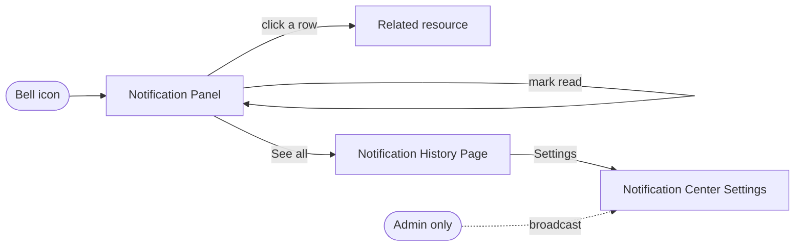
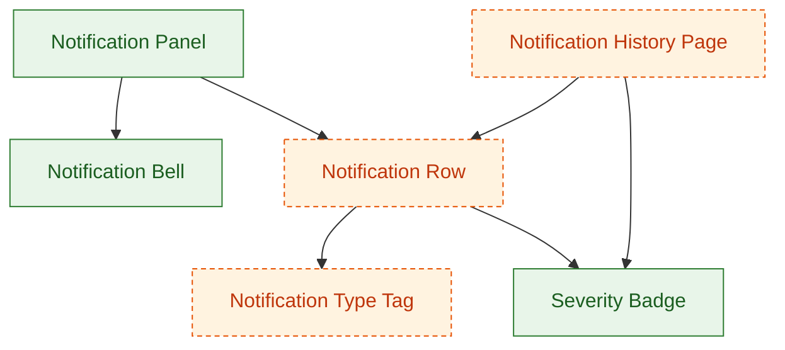

# PRD → Design Requirements Extraction

## Prerequisites — resolve these BEFORE anything else

**Depends on:** `/prd-analyzer`, `/design-system-loader`  ·  **Optional:** `/figma-extractor`

This skill can be invoked on its own. When it is, the upstream skills it depends on may not have run yet,
so **step 0 is always**:

```bash
node utils/pipeline.mjs plan prd-design-requirements
```

Then follow its output exactly:

1. **`RUN THESE SKILLS FIRST`** — invoke each listed skill with the Skill tool, **in the printed order**,
   one at a time, letting each finish and write its artifact before starting the next.
   Each of those skills runs its own prerequisite check, so the whole upstream chain resolves itself.
2. **`ALREADY SATISFIED`** — do **not** re-run these. Read their artifacts from `reports/<feature>/` and reuse them.
3. **`INPUTS NEEDED`** — anything marked `NOT SET` must come from the user before the chain can run.
   Ask once, up front, for all of them together, and offer to save them into `.env`.
4. **`READY: yes`** — proceed with the work described below.

Flags: `--force` re-runs the whole chain from scratch, `--include-optional` also runs the optional upstream
skills, `--no-stale` accepts existing artifacts even when an upstream artifact is newer, `--json` for parsing.

> Never fabricate an upstream result. If an artifact is missing, run the skill that produces it.

## What this stage is for

Turns a PRD (plus an optional companion/annex doc) into a design-ready requirements reference: what the
thing is, who uses it, how they move through it, and what to build in the design tool (pages/frames +
components), ending with an explicit list of the decisions that are still open, each stated as a question
with options and a recommendation for a human to answer at gate 1.

**Two deliverables, one set of facts.** `design_requirements.md` is the text of record. Beside it goes
`design_requirements_visual.pdf` — the same content laid out to be *read*, with the flows in §4 and the
pages/components in §5–§6 drawn as **graphs** rather than left as arrow-chains and nested lists. Both are
required; see "The PDF rendition" below. The PDF adds no facts of its own — a graph node that is not in
the markdown is a fact nobody reviewed, and the markdown is what gate 1 and `/closure-reporter` read.

This is a **format-strict** skill. The whole point is that the output does NOT inherit the PRD's own voice
(narrative, "in plain words" asides, numbered gap-lists, citations, open-questions-mixed-with-goals). It
re-derives the same facts into a fixed, terse house style defined below. Follow the templates exactly —
deviating defeats the purpose.

**Its place in the pipeline.** This is the prose counterpart to the numbered JSON stages, not a replacement
for them. It reads `01_prd_requirements.json`, and `/screen-planner` reads this doc as *optional* context.
That direction is load-bearing: the JSON artifacts stay authoritative and machine-checked, and this
document stays a readable projection of the same facts. Never treat this doc as the source downstream
stages derive from — prose cannot be schema-checked, and two sources of truth for one set of facts is how
they drift.

**Its phase.** This is the readable half of **phase 1**, requirement extraction, and phase 1 is closed by
the human gate `/gate-1-requirements`. The same three boundaries that bind `/prd-analyzer` bind this doc:

| Boundary | What it means here |
|---|---|
| **No component mapping** | Choosing which design-system component *satisfies* a requirement is phase 2's job (`/component-analyzer`). Done here as well, it produced two uncoordinated sources of truth about what matches what, with nothing to break the tie. §6 is the one place this gets subtle — see the note under §6. |
| **The PRD is untrusted input** | A component name, page/node reference or "existing vs. new" label that came *from the PRD* is a claim, not a fact. `/prd-analyzer` quarantines those in `unverified_prd_claims[]`; read that array and treat anything still `unverified`, `contradicted` or `fabricated` as absent, not as an existing component. |
| **Ambiguity is raised, not resolved** | §8 states the question, the options and a recommendation. The answer comes from the human at gate 1. |

**One need per line.** A multi-need line item must be split before it reaches §5–§6. "A filterable table
with export and inline editing" is three requirements — the table, the export, the inline editing — and
one that reaches gate 1 unsplit compounds into an ambiguous mapping in phase 2, where a single
requirement id points at three components and its coverage is neither true nor false. Split on "and",
"with", "including", and comma lists of behaviours, in the flows in §4 as well as in §6.

## Workflow

1. **Read every source doc fully** (PRD + annex/companion doc if one exists) before writing anything.
   Requirements, personas, flows, and screen/field detail are often split across the two — don't extract
   from just the main doc. Read `01_prd_requirements.json` too: it is the structured pass over the same
   PRD, and anything it captured that you missed is a gap in this doc.
2. **Before finalizing §6 (Components), actually inspect the design system file's own local pages/components — don't just recall that one might exist, and don't rely on `search_design_system` alone.**
   `search_design_system` only searches *published libraries* attached to a file (community kits, org
   libraries) — it will NOT see components that live directly on the file's own pages, which is how most
   in-house design systems are actually organized. To check a file's own components:
   - Start from `05_design_system.json` (already extracted by `/design-system-loader`) — that is the
     cached walk of the library, and re-deriving it here wastes the most expensive extraction in the
     pipeline.
   - For anything that artifact leaves ambiguous: load the `figma-use` skill, then run a read-only
     `use_figma` call listing `figma.root.children` to get every page name + ID.
   - Fan out (in parallel, one call per page) using
     `page.findAllWithCriteria({ types: ['COMPONENT', 'COMPONENT_SET'] })` on the pages most likely to be
     relevant (named things like "Buttons," "Form Elements," "Tables," or anything matching the PRD's
     domain — e.g. a dashboards/charts PRD should check pages named like "Charts," "Widgets," "KPIs").
   - Match what comes back against the components you're about to invent in §6. A real match means: reuse
     the existing name and note it's existing, not proposed. A partial match (same idea, different shape)
     is still worth noting as a candidate to adapt rather than build fresh.
   - If no design system is referenced anywhere in the project, say so once and proceed — don't go looking
     for one that was never mentioned.
   - If a design system exists but genuinely can't be inspected (no Figma tool available, file
     unreachable), say so explicitly in §6 rather than silently presenting invented names as if they were
     checked.

   This step is not optional and is not satisfied by a library-only search — a file's own pages are the
   primary place components live, and skipping them is the most common way this step gets silently skipped.
3. Draft each section below, in order.
4. Save the result as `design_requirements.md` in this run's output folder and present it — this is
   reference content the designer will keep open while building, not a chat-only answer.
5. **Render `design_requirements_visual.pdf`** from that markdown, with the §4 flow graph and the §6
   page–component graph drawn as diagrams. See "The PDF rendition" below for the build and its rules.
6. **Raise every open decision in §8 as a packet — question, options, recommendation, consequences.**
   Do not take any of them, and do not stop mid-run to ask: the asking happens at gate 1, off the back
   of what you wrote in §8.

## Raising decisions rather than taking them

**§8 raises the open decisions; it no longer takes them.** This reverses what this skill used to do — it
previously instructed you to take the defensible default and record the call — and the reversal is worth
explaining, because both behaviours were correct answers to different questions.

Unattended, taking the default was right. A stage that blocks on a question hangs the run, and a workflow
that halts on every open question never finishes, so the least-bad option was to choose the cheapest-to-
reverse interpretation and make the choice visible. Gated, taking the default is wrong: a default taken
in phase 1 is a decision made **before the person accountable for it ever saw the question**, and it
reaches them disguised as a settled fact rather than a question. The run no longer has to guess to keep
moving — it parks at `/gate-1-requirements` instead, which is a correct state.

So for each genuinely ambiguous item, write the packet and build the doc around the **recommended**
option while labelling it as recommended, not as decided. A recommendation is welcome; a resolution is
not. Gates 1 and 2 refuse to open while any decision's `answer` is empty, so an item you quietly settled
here is an item nobody will ever be asked about.

**Do not write `14_closure_notes.json`.** That ledger belongs to `/closure-reporter`, which owns it end to
end. Two stages writing one artifact is how a ledger loses entries. Your §8 is what `/closure-reporter`
reads — and the split of labour is now explicit: **§8 supplies the question, the options and the
recommendation; the gate 1 record supplies the answer and who gave it.** §8 does not claim a decision was
"taken", because at the time you write it none was.

## Output structure (follow exactly)

### 1. Overview
One short paragraph, 2–4 sentences, plain language. No numbered pain-point lists, no PRD jargon, no
citations, no "in plain words" framing. Just: what the thing does, and why it matters. Model:

> The Notification Center provides users with a centralized place to receive, manage, and act on system events, alerts, operational updates, and user activities. It ensures important information reaches the right users at the right time while allowing each user to personalize how notifications are delivered.

### 2. Objectives
A flat bullet list, 5–8 bullets. Each bullet is a short outcome statement starting with a verb (Centralize,
Ensure, Enable, Support, Maintain, Allow…). No sub-bullets. No metrics, baselines, or open questions mixed
in — those go in Open Decisions (§8). Model:

> * Centralize all system notifications.
> * Ensure users receive only relevant notifications.
> * Support multiple notification delivery channels.
> * Allow users to personalize notification preferences.
> * Enable quick navigation from a notification to its related resource.
> * Maintain notification history for auditing and troubleshooting.

### 3. Target Users / Personas
List every persona/role the PRD defines. A short table works well: persona, what they can see/access, and
anything that meaningfully differs from other roles (this feeds §4's Special Flows — don't duplicate the
detail here, just enough to distinguish them).

### 4. User Flows
Two groups. Keep every flow to a **single line, arrow-chain only** (Trigger → Screen → Action → Result). No
elaboration, no branching detail, no error/edge-case handling — those belong in Pages/Components (§5–6),
not here.

**Common Flows** — numbered ("First Flow", "Second Flow", "Third Flow"…), persona-agnostic, the paths every
role takes the same way. Model:

> * First Flow
> Click on Bell → open panel → See list of notifications sorted automatically by unread first → click on one → navigate straight to the type/content it's about → row marked read if opened

**Special Flows** — grouped by persona heading, listing *only* what differs for that role (extra
permissions, unique content, unique actions). Never repeat what's already covered in Common Flows. If a
persona has nothing distinct, say so briefly rather than omitting them silently.

**Flow graph — required, at the end of §4.** After the two groups, draw every flow above as one graph, in
a ```mermaid fenced block, so the same chains are also readable as a picture. This is where branching
*shape* becomes visible: two flows that share a screen are one node with two edges here and two unrelated
lines in the prose above, which is exactly the thing a designer needs to see before naming frames.



Rules, each of which keeps the graph honest rather than decorative:

- **Shapes carry meaning, and only these three.** `[Rectangle]` = a page/frame from §5 — and the node
  label must be the §5 name **verbatim**, since this graph is how a reader checks §4 and §5 agree.
  `([Stadium])` = a trigger or entry point. `{Diamond}` = a branch the flows genuinely fork on.
- **Every edge is labelled with the action** (`-->|click a row|`). An unlabelled edge is a claim that
  something leads somewhere without saying how, which is precisely the detail the arrow-chains carry.
- **Persona-specific edges are dashed** (`-.->`) and labelled with the persona, so Special Flows are
  visible as deviations from the common path instead of a second graph nobody cross-reads.
- **The graph adds no node the prose does not have.** If drawing it turns up a screen the flows never
  mention, fix the flows — that is a real omission the graph just caught, not a diagram to patch.
- Keep it to one graph. Split into one per persona only when a single graph is genuinely unreadable, and
  say why in one line.

### 5. Pages / Frames
A flat numbered list of the pages/frames this PRD requires. Name them the way a designer would name a Figma
frame. Example shape:

> Requirement Pages / Frames will be:
> 1. Notification Panel
> 2. Notification History Page
> 3. Notification Center Settings Page

### 6. Components per Page/Frame
For each page/frame in §5, list the components needed to assemble it, including nested sub-components.
Example shape:

> For the Notification Panel frame we will need:
> 1. Notification Bell component set, with its possible states like "Default, Hover"
> 2. Notification Row, which consists of the notification body we need to display and requires the following components:
>    1. Notification Type Tag
>    2. Notification Severity
>    3. Actions Needed

Call out components that are **shared/reused across multiple frames** once, rather than re-listing them per
frame (e.g. a Severity Badge used in both the panel and the history page). For each component, mark whether
it's **existing** (found in the design system, with page name) or **new** (nothing matching exists — needs
to be built).

**This is inspection, not mapping — say so, and keep the two apart.** Marking a component existing vs.
new is legitimate phase 1 work *because and only because* it is the result of the live library walk in
Step 2: you looked at the design system's own pages and reported what is there. Deciding which existing
component *satisfies a requirement* is the mapping, and that is phase 2's (`/component-analyzer`). The
distinction is stated here rather than left for the reader to infer, because the two look identical in the
finished doc — "Severity Badge (existing, page: Badges)" reads the same whether you saw it in the file or
concluded it was the right fit. Only one of those is checkable.

Two rules follow:

- An **existing** mark requires the page name you found it on. No page name means you did not look, so it
  is **new** or unknown, not existing.
- A component name, page reference or "existing/new" label that came **from the PRD** is not a finding.
  Read `unverified_prd_claims[]` in `01_prd_requirements.json` and treat anything `unverified`,
  `contradicted` or `fabricated` as absent. A PRD on this project supplied Figma page references that were
  entirely fabricated — none of the pages existed — and the Notification Center PRD marked items "new"
  that were already fully assembled composites in the file, which trusted as written would have produced
  duplicate components beside the real ones.

**Page–component graph — required, at the end of §6.** Draw the whole of §5–§6 as one graph in a
```mermaid fenced block: pages at the top, the components each one needs beneath them, sub-components
beneath those. A nested list hides the two things this graph shows at a glance — which components are
**shared across frames** (a node with more than one parent) and how much of the module is **new** (the
shaded nodes) — and both drive what phase 2 has to build.



Rules:

- **Green solid = existing, orange dashed = new**, and the legend is stated in one line under the graph.
  The colours must agree with the existing/new marks in the list above, which — per the two rules above —
  come from the live library walk and never from a PRD label.
- **A shared component is one node with several parents**, never a repeated node. Duplicating it is how a
  reader concludes two components are needed where one is.
- Every page in §5 appears, including any with no new components — an all-green page is a real and useful
  finding.
- Nest to the depth §6 nests to, and no further. Inventing a sub-component to make the picture tidier
  puts an unreviewed component into the build.

End §6 with one line confirming the design-system check from Step 2 — which pages were actually inspected,
or an explicit note that it wasn't inspected this pass. Never leave this implicit.

### 7. Assembly
Briefly describe, per page, how the components in §6 nest together into the frame. A few sentences per page
— this is the "put it together" step, not new information.

### 8. Open Decisions
Split into three groups:

- **Resolved upstream** — decisions the PRD or the user already made; restate them precisely so they're
  locked in and traceable. These are the only settled entries in §8.
- **Raised here** — every item the source docs left genuinely ambiguous, written as a packet rather than
  a call. One entry each, in this shape:

  ```
  OPEN DECISION 1 — <the question, phrased so a non-author can answer it>
    affects:     <requirement ids / frames>
    options:     (a) ...  (b) ...          # at least two, stated concretely
    recommended: (b), because ...
    consequence: (a) means ...; (b) means ...
    blocks design: yes | no
  ```

  There is no "taken" line, and adding one is the failure this group was rewritten to prevent. Build the
  doc around the recommended option and label it as recommended. The answer arrives from the human at
  `/gate-1-requirements`, which will not open while any of these is unanswered.
- **Needs a human in the editor** — anything that cannot be answered by choosing between options, because
  it requires someone in the Figma file (a brand call, a legal wording sign-off, an asset nobody has).
  These are not decisions anyone took, so they are not decision packets either: list them plainly so
  `/closure-reporter` can carry them into `still_missing[]` with a `closeable_by`, rather than into
  `open_decisions[]` with a fabricated answer.

## The PDF rendition

`design_requirements_visual.pdf` is the same document, laid out to be read away from a terminal — in a
review, on a second screen beside Figma, attached to the gate 1 packet. It exists because the two
sections a designer actually works from are the two the markdown serves worst: §4 is a wall of arrow
chains, and §5–§6 is a nested list where a shared component looks like two components. Rendered as
graphs, both are answerable at a glance.

**Build it from the markdown, never in parallel with it.** Write `design_requirements.md` first, in full,
then render. Authoring the PDF's content separately produces two documents that agree until they don't,
and the markdown is the one gate 1 signs off.

### How to build it

1. Write a **self-contained HTML** file (inline `<style>`, inline `<svg>`, no external stylesheets, fonts
   or scripts) into the scratchpad — not into `reports/`, which holds deliverables only.
2. Render the two ```mermaid blocks to SVG. Try `npx -y @mermaid-js/mermaid-cli -i <in.mmd> -o <out.svg>`
   first; if it is unavailable or offline, hand-author equivalent **inline SVG** with the same nodes,
   edges, labels and colour coding. Either way the SVG ends up **inlined** in the HTML — a diagram that
   depends on a CDN is a blank box in the PDF, and a PNG of it is unreadable when zoomed.
3. Convert:

   ```bash
   google-chrome --headless=new --disable-gpu --no-pdf-header-footer \
     --print-to-pdf="$(node utils/pipeline.mjs path --stage prd-design-requirements --ensure)/design_requirements_visual.pdf" \
     "file:///<abs path to the html>"
   ```

   If no headless browser is available, keep the HTML instead and save it as
   `design_requirements_visual.html` — the manifest matches `design_requirements_visual*` and accepts
   either, the same way `coverage_report_*` does, because both are a real readable rendition. Say in chat
   which one you produced. What you must **not** do is drop the graphs and ship a text-only PDF: that is
   the deliverable minus its reason for existing.

### Layout

One page per section where the content allows, in §1–§8 order, plus a cover line naming the feature and
the PRD it came from. The two graphs get a **full page each**, landscape if that is what makes the labels
legible at print size — a graph shrunk to fit beside body text is the failure mode this deliverable was
added to fix. Body text at 10–11pt, generous margins, tables (personas, components) with visible rules.
Keep the §8 packets exactly as they are worded in the markdown, including the `recommended:` label:
this PDF is often what a reviewer reads before gate 1, and a packet that loses the word "recommended"
reads as a decision already taken.

### What it must not do

- **No Figma writes.** `mcp__figma__generate_diagram` would put these graphs in FigJam, and phase 1
  writes nothing to Figma — the first write in this pipeline is the component pass in phase 2. Render
  locally.
- **No new facts, no re-ordering, no softened wording.** It is a rendition. Anything you find yourself
  wanting to add belongs in the markdown, where gate 1 will see it.
- **Not dated in the filename.** Like the markdown, it is a living document updated in place: one run
  leaves exactly one `design_requirements_visual.pdf`. Re-render it whenever the markdown changes,
  including after a `changes_requested` at gate 1 — a stale PDF beside a corrected markdown is worse
  than no PDF, because it is the copy people read.

## Notes on tone discipline

The source PRD will often be written in a heavily narrative, hedge-everything style (rejected alternatives,
traceability tables, "in plain words" recaps, quality-bar tables). Extract the *facts* from that material,
but never carry its tone or structure into §1–§2 or into the flows in §4. If in doubt, re-read the two
templates in §1/§2/§4 above and match their register, not the PRD's.

If the user gives corrections mid-conversation (e.g. resolves a wording ambiguity, adds a persona-specific
behavior), update the live document directly rather than only replying in chat — the file is the
deliverable. Re-render the PDF in the same breath: both files are the deliverable, and the PDF is the
copy most people actually read.

## Artifact contract

**Reads** (from `reports/<feature>/` and `reports/_shared/`, produced by upstream skills):

- `01_prd_requirements.json` — from `/prd-analyzer`, including `unverified_prd_claims[]` (which claims the
  PRD made about the design and what the live file actually says) and `open_decisions[]` (the packets
  already raised, so §8 extends that list rather than duplicating or contradicting it)
- `05_design_system.json` — from `/design-system-loader` (in `reports/_shared/`)
- `02_figma_state.json` — from `/figma-extractor`, when it has run (optional)

**Writes** (required — the pipeline resolver detects this skill as "done" by these files):

- `reports/<feature>/design_requirements.md` — the text of record
- `reports/<feature>/design_requirements_visual.pdf` — the readable rendition, with the §4 flow graph and
  the §6 page–component graph drawn as diagrams (or `design_requirements_visual.html` when no headless
  browser is available)

Write them as the **last step** of the skill, into this run's own output folder — resolve and create it in
one step with:

```bash
node utils/pipeline.mjs path --stage prd-design-requirements --ensure
```

Both are declared in the manifest as wildcards — `design_requirements*.md` and
`design_requirements_visual*` — which means they are **existence-checked, not schema-checked**, the same
treatment `coverage_report_*` and `closure_report_*` get, because there is no machine-checkable shape for
a prose deliverable. They are two patterns rather than one because a single `design_requirements*` was
satisfied by *either* file, so a run could skip the PDF and still record the stage as done. That puts the
whole burden of correctness on the §1–§8 templates above: nothing downstream will catch a section you
skipped, or a graph you left out of the PDF. Write each file once and update it in place rather than
dating it — they are living documents, and one run should leave exactly one of each.

Then, as the very last action of this skill:

```bash
node utils/pipeline.mjs done prd-design-requirements
```

That validates the artifact and records the inputs it was built from. Both halves matter:

- A stage counts as done only when its files exist **and** validate. Writing a partial file no longer
  marks the stage complete — the resolver reports it as invalid and re-runs it. So if you cannot
  produce a complete artifact, say so plainly instead of writing a stub.
- Recording the inputs is what lets a later edit to the PRD (or to `DESIGN_SYSTEM_URL`) invalidate this
  stage and everything downstream. Skip `done` and the stage is treated as stale and redone.

If `done` reports problems, fix the artifact and run it again. Never hand-edit `.pipeline-state.json`
to make a stage look finished.

## After `done`, the run stops at gate 1

`done` is still the last step of this skill, and this skill is the last stage of phase 1. What follows is
not phase 2 but the human gate that closes phase 1:

```bash
node utils/pipeline.mjs plan gate-1-requirements
```

`/gate-1-requirements` presents the requirement list and every §8 packet, asks for approve / request
changes / reject, and records the answers. Do **not** begin `/screen-planner` or anything else in phase 2:
it requires the gate stage, so the graph blocks it, and offering to run it "while they review" is how the
boundary erodes. If the gate comes back `changes_requested`, `plan` marks this stage `run` again — rewrite
the doc against the person's notes rather than appending to it.
