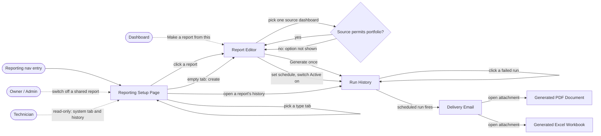
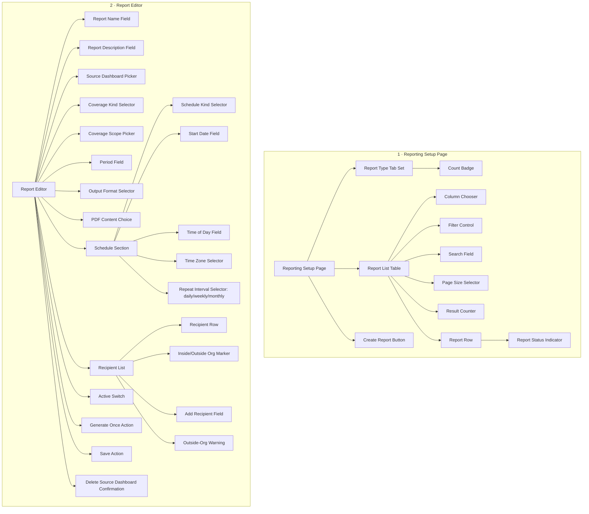
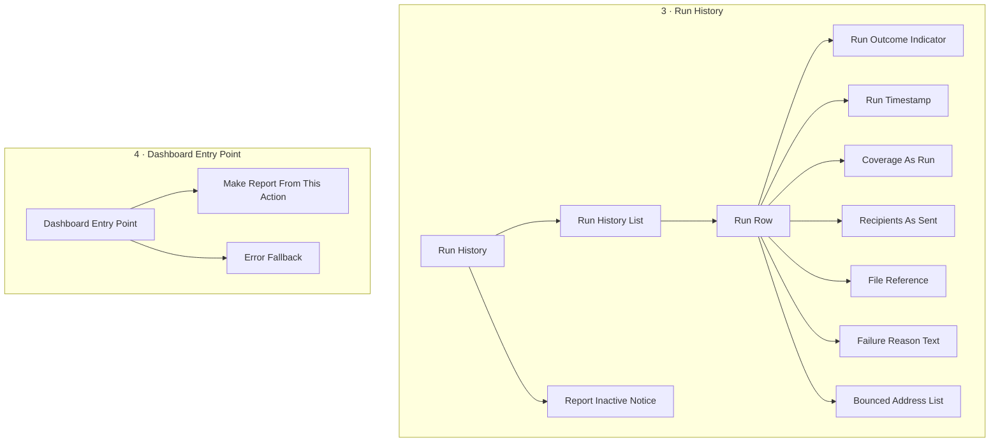
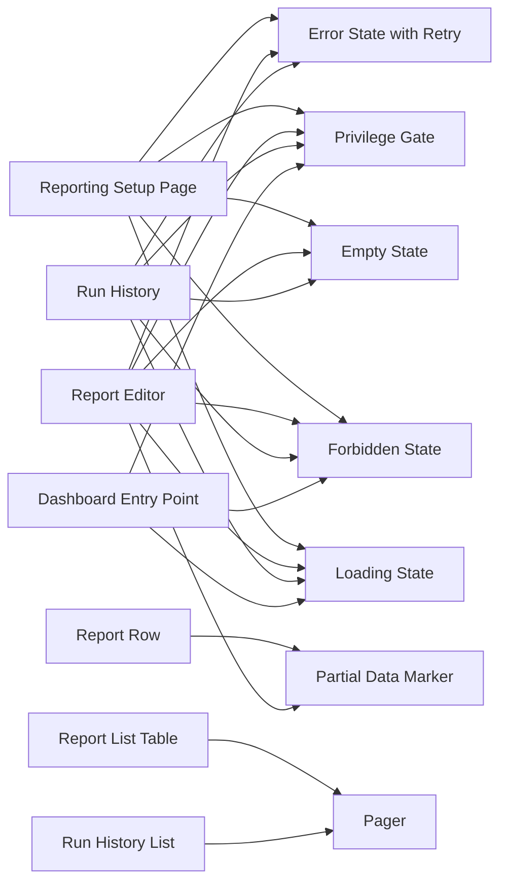

# Reporting Module — Design Requirements

*Derived from `PRD-reporting-module-v1.pdf` and its companion `PRD-reporting-module-v1-ANNEX.pdf` (2026-09-08), via `01_prd_requirements.json`.*

---

## 1. Overview

The Reporting Module turns a saved dashboard into a report that the platform builds and emails on its own, on a repeating schedule or once on demand. A person picks a report, says which sites or devices it covers, chooses a PDF or an Excel file, sets a day and a time, and lists the addresses it goes to. It matters because three teams at a live client account currently rebuild and re-send the same files by hand every week, and because a report that arrives in somebody's inbox is read by people who never open the platform at all.

---

## 2. Objectives

* Centralize report creation around dashboards that already exist.
* Enable a report to be scheduled once and delivered repeatedly without a person.
* Support one-time, on-demand generation for reports that need no schedule.
* Allow a report's coverage to be narrowed to particular sites, particular devices, or the whole portfolio.
* Ensure every produced file is recognizably the dashboard it came from.
* Make delivery outcomes visible, so a run that did not send is never mistaken for one that did.
* Gate every action on a privilege rather than a role name, and hide what a person may not do.
* Keep the manual report path that already ships working exactly as it does today.

---

## 3. Target Users / Personas

The permission model is built on the four roles the software enforces. The three client teams named in the PRD — Asset Management, O&M, and what the client calls its Technical Office — are scenarios, not roles; they map onto these four.

| Persona | What they can see / access | What differs from the others |
|---|---|---|
| **Owner** | All three report types. Every report in the client account, including reports other people shared. | Only Owner and Admin may switch off a shared report somebody else created. Holds the "send outside the organization" privilege — Owner and Admin only. *Decided at gate 1.* |
| **Admin** | All three report types. Every report in the client account. | Same as Owner for this module. The two are not distinguished by any requirement in this PRD. |
| **Engineer** | All three report types. Their own reports, plus reports shared with them. | May create, share, schedule and switch off **their own** reports, but may not switch off a shared report somebody else created. Does **not** hold the outside-organization privilege. |
| **Technician** | **Read-only.** May see system reports and read run history. May not create a private report, share, schedule, or switch anything off. | Sees only assigned sites and manages nobody. Reaches the system tab and Run History; every create, share and schedule affordance is absent, not disabled. *Decided at gate 1 (Mohamed Moanes, 2026-09-14).* |
| **Recipient** *(not a platform user)* | Nothing in the platform. Receives the delivery email and the attached file. | Has no account, no sign-in and no permissions. The PRD names the absence of any recipient-side permission check as the largest risk in the document. Everything this persona ever sees is the email and the file. |

---

## 4. User Flows

### Common Flows

* **First Flow**
Open reporting setup page → pick a type tab (system / my reports / shared) → see that type's report list → click a report → open the Report Editor

* **Second Flow**
Report Editor → pick one source dashboard → coverage options load → choose sites, devices or whole portfolio → choose PDF or Excel → for PDF choose diagrams and tables, diagrams only, or tables only → set repeating day, time and time zone → enter recipient addresses → switch Active on → platform builds and sends on schedule

* **Third Flow**
Report Editor → define the report → request Generate once → exactly one file is produced and one delivery made → run appears in Run History

* **Fourth Flow**
Open a report → open Run History → see runs newest first → click a failed run → read the reason it did not send

* **Fifth Flow**
Open a dashboard → Make a report from this → land in the Report Editor with that dashboard already chosen as the source

* **Sixth Flow**
Empty type tab → use the empty-state create affordance → Report Editor with no source chosen → source picker shown first

* **Seventh Flow**
Recipient receives delivery email → opens the attached PDF or Excel file → recognizes it as the dashboard it came from, with the source, period, coverage and declared authority named in it

### Special Flows

**Owner / Admin**

* Open reporting setup page → shared tab → open a shared report somebody else created → switch it off → delivery stops without hunting for its author

**Engineer**

* Nothing distinct on the main path. The difference is subtractive: the switch-off action on another person's shared report is absent, not disabled.

**Technician**

* Open reporting setup page → system tab → open a system report → open its Run History. Read-only: the create, share and schedule affordances are absent everywhere in the module.

**Recipient (no platform account)**

* Delivery email arrives → open attachment → read the file. There is no path back into the platform, by design.

### Flow graph

---

## 5. Pages / Frames

Requirement Pages / Frames will be:

1. Reporting Setup Page
2. Report Editor
3. Run History
4. Dashboard Entry Point
5. Generated PDF Document
6. Generated Excel Workbook
7. Delivery Email

Frames 5, 6 and 7 are design surfaces, not exports. The PRD states this outright: the PDF in its three content variants, the Excel workbook structure, and the delivery email are design work, and the email "is a fifth surface and needs a design, not a default."

---

## 6. Components per Page/Frame

**Shared across frames, listed once here rather than repeated below:**

1. **Report Type Tab Set** — three tabs (system / my reports / shared), each carrying a Count Badge
2. **Count Badge** — the per-tab count
3. **Report List Table** — with Column Chooser, Filter Control, Search Field, Pager, Page Size Selector and Result Counter ("showing X of Y")
4. **Empty State** — one per surface, each with its own message and optional create affordance
5. **Loading State** — skeleton or pending treatment, per surface
6. **Forbidden State** — the absence pattern: the control is removed and the layout closes over it
7. **Error State with Retry**
8. **Partial Data Marker** — "source unavailable" on a list row, "could not resolve" on a coverage entry or a file panel
9. **Scaled Quantity Label** — a value rendered from its stored base unit with the multiple derived from the value; used on screen and inside both file formats
10. **Privilege Gate** — not a visual component but a binding every control carries: absent, never disabled

### For the Reporting Setup Page frame we will need:

1. Report Type Tab Set *(shared)*, with:
   1. Count Badge *(shared)*
2. Report List Table *(shared)*, which consists of the report rows and requires:
   1. Column Chooser
   2. Filter Control
   3. Search Field
   4. Pager
   5. Page Size Selector
   6. Result Counter
   7. Report Row, requiring:
      1. Report Status Indicator (active / inactive / inactive-with-reason)
      2. Partial Data Marker *(shared)* — "source unavailable"
3. Create Report Button *(privilege-gated)*
4. Empty State *(shared)* — per tab, carrying the create affordance where privilege allows
5. Loading State *(shared)* — tabs and badges resolve before the list
6. Error State with Retry *(shared)* — tabs stay usable
7. Forbidden State *(shared)* — the system tab is absent, not empty

### For the Report Editor frame we will need:

1. Report Name Field (required, unique within type and account)
2. Report Description Field (optional, free text)
3. Source Dashboard Picker — exactly one, shown before every other field
4. Coverage Kind Selector — sites / devices / whole portfolio
5. Coverage Scope Picker — constrained by the source dashboard; the portfolio option is absent where the source cannot express portfolio scope
6. Period Field — defaulted from the source dashboard, overridable
7. Output Format Selector — PDF or Excel
8. PDF Content Choice — diagrams and tables / diagrams only / tables only; present only when the format is PDF
9. Schedule Section, requiring:
   1. Schedule Kind Selector — repeating / one-time
   2. Start Date Field
   3. Time of Day Field
   4. Time Zone Selector — declared and shown, never implicit
   5. Repeat Interval Selector — daily / weekly / monthly
10. Recipient List, requiring:
    1. Recipient Row — address, with a remove action
    2. Inside/Outside Organization Marker — derived from the address, not entered
    3. Add Recipient Field
    4. Outside-Organization Warning — shown before an external address is accepted
11. Active Switch — off by default on creation
12. Generate Once Action
13. Save Action
14. Empty State *(shared)* — source picker only, everything else absent until a source is chosen
15. Loading State *(shared)* — coverage options visibly pending after the source is picked
16. Forbidden State *(shared)* — controls the person lacks are absent, with no gap left in the layout
17. Error State *(shared)* — a save failure keeps every entered value
18. Partial Data Marker *(shared)* — resolved coverage shown, unresolved coverage named
19. Delete Source Dashboard Confirmation — names every dependent scheduled report and how many, and requires a second deliberate action

### For the Run History frame we will need:

1. Run History List, requiring:
   1. Run Row, requiring:
      1. Run Outcome Indicator — succeeded / failed / running / delivered-with-failures / suppressed
      2. Run Timestamp
      3. Coverage As Run
      4. Recipients As Sent
      5. File Reference
      6. Failure Reason Text
      7. Bounced Address List — on a delivered-with-failures run
   2. Pager *(shared)* — newest first
2. Report Inactive Notice — the report went inactive after bounded retries, or because its authority lost access, or because its source dashboard was deleted; each with its reason
3. Empty State *(shared)* — never run, stated plainly and not as an error
4. Loading State *(shared)*
5. Forbidden State *(shared)* — absent without the read-history privilege
6. Error State with Retry *(shared)* — does not block the report itself

### For the Dashboard Entry Point frame we will need:

1. Make Report From This Action — an affordance placed on a dashboard
2. Inline Loading State *(shared)*
3. Forbidden State *(shared)* — hidden where the create privilege is absent
4. Error Fallback — routes to the Reporting Setup Page with the source pre-chosen

### For the Generated PDF Document frame we will need:

1. Report File Header, requiring:
   1. Report Name
   2. Source Dashboard Name
   3. Period Covered
   4. Coverage Summary
   5. Declared Authority Statement — whose view of the portfolio this file represents
2. Diagram Panel Block
3. Table Panel Block
4. Scaled Quantity Label *(shared)*
5. Content Variant: Diagrams and Tables
6. Content Variant: Diagrams Only
7. Content Variant: Tables Only
8. No Readings Statement — a file that says there were no readings, never an empty page
9. Unrendered Panel Placeholder — names the problem, never a blank

### For the Generated Excel Workbook frame we will need:

1. Workbook Cover Sheet — the same identity fields as the PDF header
2. Panel Sheet — one sheet per dashboard panel
3. Series Values Layout — the values behind a chart, for a diagram panel
4. Table Values Layout — for a table panel
5. Scaled Quantity Label *(shared)*
6. No Readings Sheet — a sheet stating there were no readings, not an empty sheet
7. Unresolvable Panel Sheet — a sheet naming the problem

### For the Delivery Email frame we will need:

1. Email Subject Line — identifying the report
2. Email Body Block, requiring:
   1. Report Name
   2. Source Dashboard Name
   3. Period Covered
   4. Coverage Summary
3. Attachment Reference
4. Sender Identity Block

### Page–component graphs

Four graphs rather than one. A single graph over all seven frames is ~70 nodes and renders unreadably at any aspect ratio; these four split it along seams where nothing is shared across the cut, except where noted.

**Graph 1 — Reporting Setup Page and Report Editor.**

**Graph 2 — Run History and Dashboard Entry Point.**

**Graph 3 — the components shared across those four screen frames.** This is the sharing view: each shared component is one node, and its several parents are the frames that need it. The frame and container nodes here are the same ones as in graphs 1 and 2, not new components.

**Graph 4 — the three produced artefacts.** The five identity fields and the Scaled Quantity Label are one node each, shared by all three.

```mermaid
flowchart TB
  subgraph SG5["5 · Generated PDF Document"]
    direction LR
    P5[Generated PDF Document] --> FileHdr[Report File Header]
    P5 --> DiagBlock[Diagram Panel Block]
    P5 --> TableBlock[Table Panel Block]
    P5 --> VarBoth[Variant: Diagrams and Tables]
    P5 --> VarDiag[Variant: Diagrams Only]
    P5 --> VarTab[Variant: Tables Only]
    P5 --> NoRead[No Readings Statement]
    P5 --> Unrendered[Unrendered Panel Placeholder]
  end
  subgraph SG6["6 · Generated Excel Workbook"]
    direction LR
    P6[Generated Excel Workbook] --> Cover[Workbook Cover Sheet]
    P6 --> PanelSheet[Panel Sheet]
    PanelSheet --> SeriesVals[Series Values Layout]
    PanelSheet --> TableVals[Table Values Layout]
    P6 --> NoReadSheet[No Readings Sheet]
    P6 --> UnresSheet[Unresolvable Panel Sheet]
  end
  subgraph SG7["7 · Delivery Email"]
    direction LR
    P7[Delivery Email] --> Subject[Email Subject Line]
    P7 --> BodyBlock[Email Body Block]
    P7 --> AttachRef[Attachment Reference]
    P7 --> Sender[Sender Identity Block]
  end
  subgraph SGI["Identity fields — shared by all three artefacts"]
    direction LR
    RepName[Report Name]
    SrcName[Source Dashboard Name]
    PeriodCov[Period Covered]
    CovSum[Coverage Summary]
    Authority[Declared Authority Statement]
    Scaled[Scaled Quantity Label]
  end
  FileHdr --> RepName
  FileHdr --> SrcName
  FileHdr --> PeriodCov
  FileHdr --> CovSum
  FileHdr --> Authority
  Cover --> RepName
  Cover --> SrcName
  Cover --> PeriodCov
  Cover --> CovSum
  Cover --> Authority
  BodyBlock --> RepName
  BodyBlock --> SrcName
  BodyBlock --> PeriodCov
  BodyBlock --> CovSum
  P5 --> Scaled
  P6 --> Scaled
  SG5 ~~~ SG6
  SG6 ~~~ SG7
  SG7 ~~~ SGI
```

**Existence in the design system was not checked in this phase.** Nothing above is marked existing or new, and no design-system page is named. Whether the library already provides any of these components is resolved by `/component-analyzer` after gate 1, against the live file, recorded per requirement with the variants it actually checked.

---

## 7. Assembly

**Reporting Setup Page.** A page header sits above the Report Type Tab Set; each tab carries its Count Badge. Beneath the active tab, the Report List Table fills the page, with the Search Field, Filter Control and Column Chooser in a toolbar above it and the Pager, Page Size Selector and Result Counter beneath. The Create Report Button sits in the header, absent entirely where the privilege is missing. Each Report Row carries a Report Status Indicator and, where its source has gone, a Partial Data Marker in place of the source name. The four surface states replace the table region only — the tabs stay mounted through the error state.

**Report Editor.** A single vertical form, gated on the Source Dashboard Picker: until a source is chosen, the picker is the only thing on the page. Once chosen, the remaining fields resolve in order — name and description, then the Coverage Kind Selector with the Coverage Scope Picker nested under it, then the Period Field, then the Output Format Selector with the PDF Content Choice appearing only under PDF. The Schedule Section groups its five controls as one block, with the Time Zone Selector adjacent to the Time of Day Field so the two read together. The Recipient List is a stack of Recipient Rows, each carrying its Inside/Outside Organization Marker, with the Add Recipient Field beneath and the Outside-Organization Warning appearing inline when an external address is entered. The Active Switch and the Generate Once Action sit in the page footer beside Save. The Delete Source Dashboard Confirmation is a modal raised from the dashboard surface, not from this page, but it is specified here because it lists this module's reports.

**Run History.** Reached from a report. A Run History List of Run Rows, newest first, paged. Each Run Row leads with its Run Outcome Indicator and timestamp, then coverage as run, recipients as sent and the file reference; a failed row expands to its Failure Reason Text, and a delivered-with-failures row to its Bounced Address List. Where the report itself has gone inactive, the Report Inactive Notice sits above the list with its reason, because that state belongs to the report and not to any single run.

**Dashboard Entry Point.** A single action placed in a dashboard's own header or overflow menu. It carries an inline loading treatment rather than a page transition, and on error it routes to the Reporting Setup Page with the source pre-chosen rather than failing in place.

**Generated PDF Document.** The Report File Header opens the file and carries the five identity fields, including the Declared Authority Statement. Beneath it, Diagram Panel Blocks and Table Panel Blocks follow the source dashboard's own ordering and grouping — this is what the operator-confirm check tests. The three content variants are the same layout with one or both block types omitted. Every quantity renders through the Scaled Quantity Label. Where a period has no readings the No Readings Statement replaces the panel region entirely; where a single panel fails, the Unrendered Panel Placeholder replaces that panel only.

**Generated Excel Workbook.** The Workbook Cover Sheet carries the same identity fields as the PDF header, then one Panel Sheet per dashboard panel, named for its panel. A diagram panel's sheet uses the Series Values Layout; a table panel's uses the Table Values Layout. The No Readings Sheet and the Unresolvable Panel Sheet substitute for a Panel Sheet at the same position, so sheet order still matches panel order.

**Delivery Email.** The Email Subject Line identifies the report and its period. The Email Body Block repeats the four identity fields so a recipient with no platform account can tell what arrived and what it covers, with the Sender Identity Block beneath and the Attachment Reference naming the file. There is no link back into the platform, and no partial email is ever sent.

---

## 8. Open Decisions

### Resolved upstream

These were decided by the PRD or the Product Manager and are restated so they stay locked in:

* **Reports are dashboard snapshots.** No new chart, figure or KPI is invented in this module. If a person wants what no dashboard shows, they build the dashboard first.
* **A report sources from exactly one saved dashboard.** Not several. Multiple sources would make coverage, period and authority ambiguous.
* **Email is the only delivery route.** No in-platform inbox, no download links, no file storage surface.
* **Two output formats only: PDF and Excel.** A third format is a later registration, not a rewrite.
* **Three report types: system, private ("my reports"), shared** — presented as tabs.
* **Three coverage kinds: particular sites, particular devices, whole portfolio** — and the portfolio option is offered only where the source dashboard's scope can express it.
* **Three PDF content choices: diagrams and tables, diagrams only, tables only.**
* **Where a person lacks a privilege, the control is hidden, not greyed out**, and the layout leaves no hole where it would have been.
* **Every action is gated on a privilege, never a role name**, because a later Admin Module release lets clients define their own roles.
* **No backfill.** Switching a report back on after two weeks off does not send fourteen files.
* **The time zone is declared and shown on screen**, never implicit.
* **Report definitions, files and run history are scoped to one client account** and unreadable from another by any route.
* **The manual report path that already shipped is unchanged.**
* **No mobile surface**, no formula-sourced reports, no billing documents, no editing or annotating a generated file.
* **No recipient-side permission check exists**, by design — recipients are email addresses, not platform users. The PRD names this the largest risk in the document.

*Decided at gate 1 by **Mohamed Moanes**, 2026-09-14. Every one of these was raised here as a packet in
round 1 and answered at the gate; all twelve answers matched the recommendation.*

* **The schedule is set inside the report editor**, alongside coverage, format and recipients — not in a separate step.
* **The dashboard entry point opens the full report editor** with the source dashboard pre-chosen, rather than a short form. One authoring surface.
* **The recipient list is a scrolling list of rows**, one address per row, each carrying the inside/outside-organization marker and a remove action.
* **Run history sits on each report**, reached from that report and scoped to it. There is no module-wide history view in this release.
* **The repeat intervals are daily, weekly and monthly** — a fixed set of three. No quarterly, no yearly, no arbitrary interval builder.
* **A Technician is read-only in this module**: may see system reports and read run history; may not create, share, schedule or switch anything off.
* **A report may be emailed outside the client's organization**, gated on the "send outside the organization" privilege, held by **Owner and Admin only**. Engineers do not hold it.
* **Accessibility: WCAG 2.2 AA across the four screen surfaces only.** The produced PDF and the delivery email are out of scope for accessibility this release; tagged PDF is explicitly not required.
* **A diagram panel exported to Excel carries the series values behind the chart**, so a chart-only dashboard still produces a usable workbook. (Confirms the PRD's Architect-proposed Requirement 6.)
* **"Technical Office" is the client's own wording** and is not named in the design; it maps onto the four roles the software enforces.
* **The attachment ceiling is not surfaced in the editor.** It appears only as a failed run with a stated reason in run history — the ceiling figure is still unsupplied.
* **Generated files are retained but not retrievable from the UI** in this release. A run row references its file without offering it, because download links are an explicit non-goal.

* **A monthly schedule whose start day is missing from a month runs on that month's last day** — it never skips a month, and the Start Date Field states this. *(Gate 1 round 3.)*
* **A retained file has no UI retrieval route.** Retrieval of a too-large file is a support or engineering action; the run row says so rather than implying self-service, and download links remain an explicit non-goal. *(Gate 1 round 3.)*

### Raised here

*Nothing. Every decision raised in this document has been answered at gate 1 — twelve in round 1, and the two those answers made askable in round 3. All fourteen are recorded above under Resolved upstream with what was decided and by whom.*

### Needs a human in the editor

These cannot be answered by choosing between options. They need somebody in the Figma file, or a person outside this pipeline:

* **The delivery email's copy.** The PRD requires the email to be designed but specifies none of its wording. Subject line, body text and sender name need writing and, if the file may leave the client's organization, a legal read.
* **The sender identity.** What address the email comes from, what name it displays, and whether it carries client branding or Sand's. Nothing in the PRD or ANNEX addresses this.
* **PDF page furniture.** Page size, margins, header/footer treatment, pagination and whether a cover page exists. The PRD requires the file to be "recognizably the dashboard it came from" and specifies nothing about the page it sits on.
* **The failure-reason wording.** Eleven failure states each require a stated reason shown to a person. The reasons themselves are unwritten, and several are the only thing a user will ever see about a run that did not happen.
* **The five [NEEDS INPUT] quality bars with no design consequence yet** — generation time, concurrency, uptime, volume, and file retention duration. These are engineering figures nobody has supplied; they are recorded here so they are not mistaken for settled.
