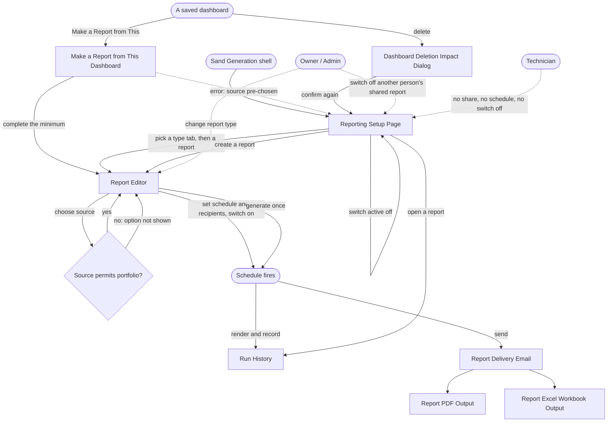
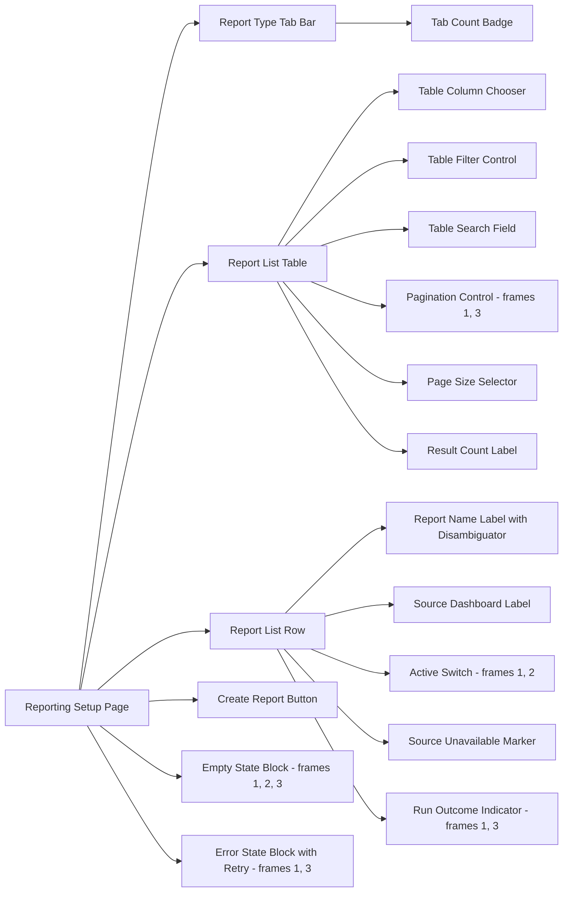
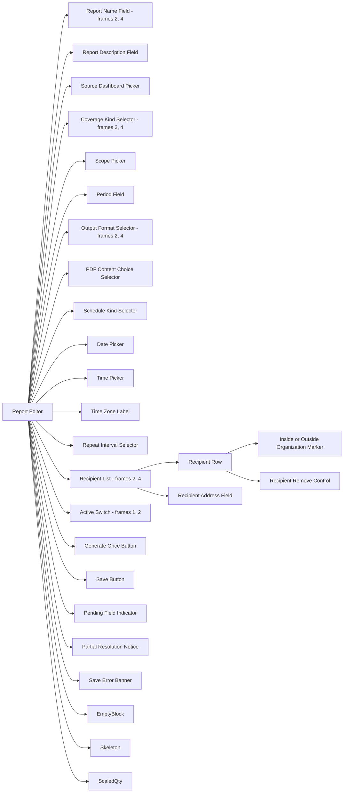
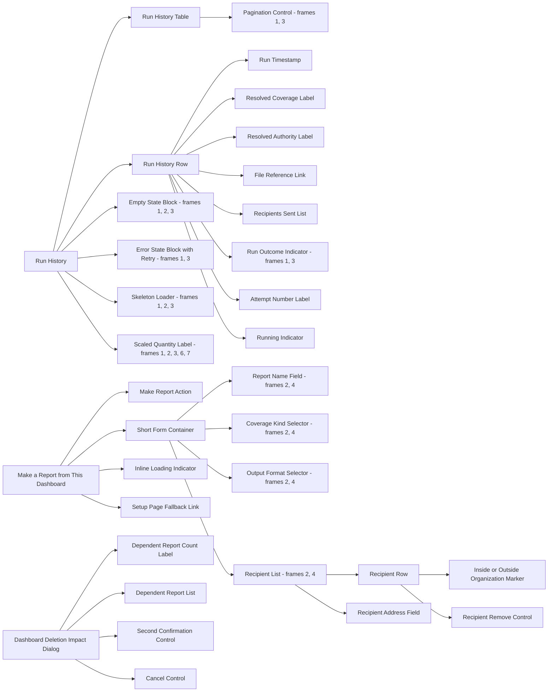
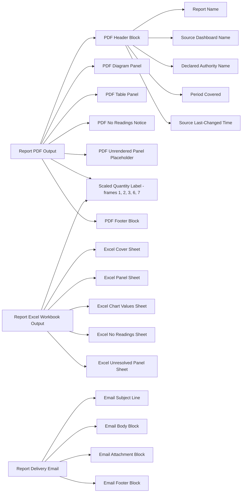

# Reporting Module — Design Requirements

Derived from `PRD-reporting-module-v1.pdf` and `PRD-reporting-module-v1-ANNEX.pdf` (v1, 2026-09-08).
Phase 1 reference. No design-system or Figma inspection has been performed — see the closing note of §6.

---

## 1. Overview

The Reporting Module turns a dashboard somebody already saved into a file that arrives by email on its
own. A person picks a report, says which sites or devices it covers, picks a PDF or an Excel file, sets a
repeating day and time, and lists the addresses it goes to. After that the platform builds the file and
sends it, records every run, and stops on its own when the source disappears or the sender loses access.

---

## 2. Objectives

* Centralize scheduled report delivery in one place per client account.
* Enable a saved dashboard to become a repeating report without rebuilding it.
* Support PDF and Excel output from the same report definition.
* Allow coverage to be narrowed to particular sites, particular devices, or the whole portfolio.
* Ensure every schedule resolves in a time zone stated on screen.
* Maintain a run history that records each delivery before it is sent.
* Make a failed run visible to the person who created it without turning the page into an incident view.
* Gate every action on a privilege rather than a role name.

---

## 3. Target Users / Personas

The four roles below are the ones the software enforces, taken from the Admin Module. The PRD deliberately
does not map them onto the eight commercial role names, and neither does this document.

| Persona | What they can see / access | What differs |
|---|---|---|
| **Owner** | All three report types. Own and others' shared reports. Run history for anything visible. | May switch off a shared report somebody else created. May change a report's type. Outside-organization sending pending OPEN DECISION 7. |
| **Admin** | Same as Owner. | Same as Owner. |
| **Engineer** | All three report types. Own reports; shared reports created by others are visible but not controllable. | May create, share and schedule own reports. Cannot switch off another person's shared report — that control is hidden, not disabled. |
| **Technician** | Assigned sites only. Manages nobody. | Cannot share, schedule, or switch off any report. Whether a Technician sees system reports, creates private reports, or reads run history is unanswered — OPEN DECISION 8. Design must hold for the case where all three are denied. |

Three client teams — Asset Management, O&M, and the client's own Technical Office — are where the need
originates. Only Technician appears in both that vocabulary and the enforced list; no mapping is proposed,
so they are not personas here.

---

## 4. User Flows

### Common Flows

* **First Flow**
Open Reporting Setup Page → pick a report type tab → see that tab's list with its count badge → filter, search or page the list → open a report

* **Second Flow**
Open Report Editor → choose one saved dashboard as source → source name shows on screen → coverage options resolve as visibly pending → choose coverage kind → choose covered scopes

* **Third Flow**
In Report Editor → choose PDF or Excel → if PDF, choose diagrams and tables, diagrams only, or tables only → set the period

* **Fourth Flow**
In Report Editor → choose repeating or one-time → set start date → set time of day → read the declared time zone → choose repeat interval

* **Fifth Flow**
In Report Editor → add a recipient address → address shows as inside or outside the organization → repeat per address → switch active on

* **Sixth Flow**
Open a report → request generate once → one file produced → one delivery sent → one run recorded

* **Seventh Flow**
Open a dashboard → choose Make a Report from This → form opens with the source pre-chosen → complete the minimum → save

* **Eighth Flow**
Open a report → open Run History → runs listed newest first → read outcome, recipients as sent, and file reference

* **Ninth Flow**
Open Reporting Setup Page → find the report → switch active off → delivery stops, and switching on later does not backfill

* **Tenth Flow**
Schedule fires → authority resolved at the run → file rendered → delivery recorded → Report Delivery Email sent with attachment

* **Eleventh Flow**
Delete a source dashboard → Dashboard Deletion Impact Dialog names every dependent report and how many → confirm as a second deliberate action → those reports go inactive with the reason recorded

### Special Flows

**Owner**
Switch off a shared report created by somebody else, without finding its author. Change a report's type
after creation.

**Admin**
Nothing distinct from Owner in this module.

**Engineer**
Create, share and schedule own reports. The switch-off control on another person's shared report is
absent from the row entirely.

**Technician**
No sharing, no scheduling, no switching off. Every remaining surface is pending OPEN DECISION 8; where
denied, the control is absent and the layout closes over it.

### Flow graph



---

## 5. Pages / Frames

Requirement Pages / Frames will be:

1. Reporting Setup Page
2. Report Editor
3. Run History
4. Make a Report from This Dashboard
5. Dashboard Deletion Impact Dialog
6. Report PDF Output
7. Report Excel Workbook Output
8. Report Delivery Email

Frames 6–8 are surfaces nobody clicks and all three still need designing; the PRD names the email
explicitly as needing a design rather than a default. Frame 5 sits inside a flow owned by the dashboard
builders — see OPEN DECISION 9.

---

## 6. Components per Page/Frame

**Shared across frames, listed once:** Active Switch (1, 2), Pagination Control (1, 3), Run Outcome
Indicator (1, 3), Empty State Block (1, 2, 3), Error State Block with Retry (1, 3), Skeleton Loader
(1, 2, 3), Scaled Quantity Label (1, 2, 3, 6, 7), Report Name Field (2, 4), Coverage Kind Selector (2, 4),
Output Format Selector (2, 4), Recipient List (2, 4).

### For the Reporting Setup Page frame we will need:

1. Report Type Tab Bar, with exactly three tabs — system, my reports, shared
   1. Tab Count Badge
2. Report List Table
   1. Table Column Chooser
   2. Table Filter Control
   3. Table Search Field
   4. Pagination Control
   5. Page Size Selector
   6. Result Count Label, reading "showing X of Y"
3. Report List Row
   1. Report Name Label with Disambiguator, for two reports sharing a name
   2. Source Dashboard Label
   3. Active Switch
   4. Source Unavailable Marker
   5. Run Outcome Indicator
4. Create Report Button
5. Empty State Block, per tab, carrying the way to make one
6. Error State Block with Retry, leaving the tabs usable
7. Skeleton Loader, resolving tab shape and badges before the list

### For the Report Editor frame we will need:

1. Report Name Field
2. Report Description Field
3. Source Dashboard Picker, single-select over saved dashboards
4. Coverage Kind Selector, with exactly three options — sites, devices, portfolio
5. Scope Picker, multi-select over sites or devices
6. Period Field
7. Output Format Selector, with exactly two options — PDF, Excel
8. PDF Content Choice Selector, with exactly three options — diagrams and tables, diagrams only, tables only
9. Schedule Kind Selector, with two options — repeating, one-time
10. Date Picker
11. Time Picker
12. Time Zone Label
13. Repeat Interval Selector
14. Recipient List
    1. Recipient Row
    2. Recipient Address Field
    3. Inside or Outside Organization Marker
    4. Recipient Remove Control
15. Active Switch, off by default on creation
16. Generate Once Button
17. Save Button
18. Pending Field Indicator, for coverage options resolving after the source is chosen
19. Partial Resolution Notice, naming what did not resolve
20. Save Error Banner, preserving every entered value
21. Empty State Block, showing the source picker first

### For the Run History frame we will need:

1. Run History Table
   1. Pagination Control
2. Run History Row
   1. Run Timestamp
   2. Resolved Coverage Label
   3. Resolved Authority Label
   4. File Reference Link
   5. Recipients Sent List
   6. Run Outcome Indicator
   7. Attempt Number Label
   8. Running Indicator
3. Empty State Block, saying the report has never run
4. Error State Block with Retry, not blocking the report itself

### For the Make a Report from This Dashboard frame we will need:

1. Make Report Action, placed on a dashboard
2. Short Form Container, with the source pre-chosen
   1. Report Name Field
   2. Coverage Kind Selector
   3. Output Format Selector
   4. Recipient List
3. Inline Loading Indicator
4. Setup Page Fallback Link

### For the Dashboard Deletion Impact Dialog frame we will need:

1. Dependent Report Count Label
2. Dependent Report List
3. Second Confirmation Control
4. Cancel Control

### For the Report PDF Output frame we will need:

1. PDF Header Block
   1. Report Name
   2. Source Dashboard Name
   3. Declared Authority Name
   4. Period Covered
   5. Source Last-Changed Time
2. PDF Diagram Panel
3. PDF Table Panel
4. PDF No Readings Notice
5. PDF Unrendered Panel Placeholder
6. Scaled Quantity Label
7. PDF Footer Block

### For the Report Excel Workbook Output frame we will need:

1. Excel Cover Sheet
2. Excel Panel Sheet, one per dashboard panel
3. Excel Chart Values Sheet, carrying the values behind a diagram
4. Excel No Readings Sheet
5. Excel Unresolved Panel Sheet
6. Scaled Quantity Label

### For the Report Delivery Email frame we will need:

1. Email Subject Line
2. Email Body Block, naming the report, its period and its source dashboard
3. Email Attachment Block
4. Email Footer Block

### Page–component graph

Split into four graphs, one per frame group: as a single graph the eight frames and their seventy
components lay out at a 16:1 aspect ratio in which no label is readable, so the split is for legibility
rather than meaning. A component used by more than one frame carries every frame that uses it in its
label, so cross-frame sharing stays stated wherever a split separates it from one of its parents.

**Graph 1 of 4 — Reporting Setup Page.**



**Graph 2 of 4 — Report Editor.**



**Graph 3 of 4 — Run History, Make a Report from This Dashboard, Dashboard Deletion Impact Dialog.**



**Graph 4 of 4 — Report PDF Output, Report Excel Workbook Output, Report Delivery Email.**



**Existence in the design system was not checked in this phase.** Every component above is stated as a
need, not as a finding. Whether the library already provides it — and with which variants — is resolved
by `/component-analyzer` after gate 1, per requirement, with the variants it checked recorded as
evidence.

---

## 7. Assembly

**Reporting Setup Page.** Report Type Tab Bar across the top, each tab carrying a Tab Count Badge. Beneath
it the Report List Table with its column chooser, filter, search, page-size selector and result count in a
toolbar row, and the Create Report Button aligned to that row. The table body is Report List Rows; each
row carries the report name with its disambiguator, the source dashboard label, a run outcome indicator,
an Active Switch, and a Source Unavailable Marker in place of the outcome where the source is gone. Empty,
error and loading substitute into the table body only — the tab bar stays mounted and usable in all three.

**Report Editor.** One column, ordered by dependency: Source Dashboard Picker first, because everything
below it derives from the source. Coverage Kind Selector and Scope Picker follow, with the Pending Field
Indicator occupying them while options resolve and the Partial Resolution Notice sitting beneath them when
only some scopes resolve. Then Period Field, then Output Format Selector with the PDF Content Choice
Selector revealed only under PDF. Schedule Kind Selector next, revealing Date Picker, Time Picker, Time
Zone Label and Repeat Interval Selector under repeating. Recipient List last, as a scrollable stack of
Recipient Rows each carrying its address, its inside/outside marker and its remove control, with the
Recipient Address Field beneath as the add row. Active Switch, Generate Once Button and Save Button in a
footer bar; the Save Error Banner sits above that footer and never clears the fields.

**Run History.** Run History Table with the Pagination Control in its footer; rows newest first. Each Run
History Row is a timestamp, resolved coverage, resolved authority, recipients as sent, attempt number and
outcome, with the File Reference Link at the end. A mid-flight run substitutes the Running Indicator for
the outcome. Empty and error substitute into the table body without unmounting the surrounding report.

**Make a Report from This Dashboard.** Make Report Action lives on the dashboard. It opens the Short Form
Container with the source already bound and not editable, containing only Report Name Field, Coverage Kind
Selector, Output Format Selector and Recipient List. Inline Loading Indicator sits within the container.
The Setup Page Fallback Link is the error path, carrying the pre-chosen source across.

**Dashboard Deletion Impact Dialog.** Dependent Report Count Label as the headline, Dependent Report List
beneath it, then Cancel Control and Second Confirmation Control. The confirmation is the second deliberate
act, so it is never the default focus.

**Report PDF Output.** PDF Header Block on page one carrying report name, source dashboard, declared
authority, period and source last-changed time. Body is PDF Diagram Panels and PDF Table Panels in
dashboard order, filtered to the chosen content variant. A panel that fails renders the PDF Unrendered
Panel Placeholder in its place, at its size. A period with no readings replaces the whole body with the
PDF No Readings Notice. Every quantity renders through the Scaled Quantity Label.

**Report Excel Workbook Output.** Excel Cover Sheet first, carrying the same header facts as the PDF. Then
one Excel Panel Sheet per dashboard panel in dashboard order; a diagram panel's sheet is an Excel Chart
Values Sheet. An unresolvable panel gets an Excel Unresolved Panel Sheet naming the problem rather than
being omitted. No readings gives one Excel No Readings Sheet.

**Report Delivery Email.** Email Subject Line naming the report and period. Email Body Block repeating
report name, period and source dashboard. Email Attachment Block carrying the single file. Email Footer
Block. Nothing partial ever sends.

---

## 8. Open Decisions

### Resolved upstream

* Permission model uses the Admin Module's four roles (Owner, Admin, Engineer, Technician), not the eight
  commercial role names. No mapping between the two lists is proposed.
* Every requirement is written against a privilege, never a role name.
* Exactly three report types: system, my reports, shared. Not to be altered.
* Exactly three coverage kinds: particular sites, particular devices, whole portfolio. Not to be altered.
* Exactly two output formats: PDF and Excel. Not to be altered.
* Exactly three PDF content choices: diagrams and tables, diagrams only, tables only. Not to be altered.
* Where a privilege is absent the control is hidden, not greyed out, and the layout leaves no hole.
* Nobody in the client account may change what a system report contains.
* A report sources from exactly one saved dashboard.
* Delivery is email only. No in-platform inbox, no download links, no file storage delivery.
* Recipients are email addresses and need not be platform users. No recipient-side permission check exists.
* Switching a report on after it was off does not backfill missed runs.
* A one-time report requested twice produces two runs, two files and two deliveries.
* The manual report creation that already shipped is unchanged.
* No delivery date, target quarter or committed date is in scope; order is stated instead.

### Raised here

```
OPEN DECISION 1 — Is the schedule set on the report itself, or in a separate step?
  affects:     REQ-19, REQ-60, REQ-71..REQ-74; frames 2, 4
  options:     (a) A separate step — the editor saves the definition, scheduling is a distinct stage after
               (b) On the report — schedule fields inline in the Report Editor beside coverage, format and recipients
  recommended: (b), because it matches the flow the Product Manager described and keeps one editor and one save
  consequence: (a) means shorter screens and a natural home for a reusable schedule later, at the cost of a
               second save, a second set of five states, and a flow that no longer matches how the PRD
               describes the task; (b) means a long editor that already needs progressive disclosure,
               because coverage cannot load until the source is chosen
  blocks design: yes
```

```
OPEN DECISION 2 — Is a schedule a property of one report, or a reusable object several reports share?
  affects:     REQ-19, REQ-20, REQ-71; frame 2
  options:     (a) A property of one report — each report owns its own schedule
               (b) A reusable object — a named schedule several reports attach to
  recommended: (a), because the PRD proposes it explicitly and it needs no schedule library, no attach or
               detach interaction, and no answer to what an edit does to nine attached reports
  consequence: (a) means changing "Monday 07:00" for nine reports is nine edits; (b) means one edit with a
               blast radius that is invisible at the point of editing, plus a management surface nobody asked for
  blocks design: yes
```

```
OPEN DECISION 3 — Which repeat intervals are offered?
  affects:     REQ-74; frame 2, Repeat Interval Selector
  options:     (a) Daily, weekly, monthly
               (b) Daily, weekly, monthly, quarterly, yearly
               (c) A free recurrence builder — every N days/weeks/months with weekday selection
  recommended: (a), because it is a single select, testable in one check, and covers all five use cases the
               PRD names, which are weekly or one-off
  consequence: The Product Manager said "periodically" without naming a set, so nothing here is specified.
               (a) means a fixed select; (b) is nearly free in the control but each added interval needs a
               defined anchor day; (c) is a substantially larger design and interacts with both the
               time-zone rule and concurrency sizing, which is itself unanswered
  blocks design: yes
```

```
OPEN DECISION 4 — Does run history sit on each report, or in one place for all of them?
  affects:     REQ-32, REQ-33, REQ-89..REQ-93, REQ-109; frame 3
  options:     (a) On each report — history is a view within the report
               (b) One central place — a module-level history across all reports, filterable by report
               (c) Both — a central list plus a per-report view
  recommended: (a), because Requirement 16 specifies "a run history per report", and per-report keeps the
               forbidden state simple and the error state contained
  consequence: (a) answers "find out that last night's report did not send" badly — the person must already
               know which report failed, and with nine reports that is nine places to look; (b) answers it
               directly and is where the visible-without-alarming requirement naturally lives; (c) is the
               most useful and the most to design and state-matrix
  blocks design: yes
```

```
OPEN DECISION 5 — Does the entry point from a dashboard open the full setup page, or a short form?
  affects:     REQ-61, REQ-94..REQ-96; frame 4
  options:     (a) The full Report Editor, navigated to with the source pre-chosen
               (b) A short form — a compact overlay capturing the minimum, source pre-chosen
  recommended: (b), because it keeps the person on their dashboard and suits the "one report now, one site,
               no schedule" use case
  consequence: (b) needs a defined minimum field set, its own validation, and a defined path to the full
               editor for anything it omits — and the annex already specifies its error state falls back to
               the setup page with the source pre-chosen, so both surfaces exist either way; (a) adds no new
               surface and no second field set, at the cost of pulling the person out of the dashboard
  blocks design: yes
```

```
OPEN DECISION 6 — What does the recipient list look like at twenty addresses?
  affects:     REQ-27, REQ-75, REQ-76, REQ-107; frames 2, 4
  options:     (a) A chip or token field — removable tokens that wrap, with a scroll cap
               (b) A managed list — one row per address, scrollable, per-row remove, with an add field
               (c) A textarea of addresses parsed on save
  recommended: (b), because it is the only one of the three with somewhere to put per-address information,
               and two requirements need exactly that
  consequence: Inside-or-outside-the-organization is derived per address and gates a privilege (REQ-76), and
               a bounce is reported per address (REQ-107). (a) has no room for either and twenty tokens wrap
               into an unreadable block; (c) is cheapest and worst — it cannot show derived state at all, and
               it makes a typo in a portfolio recipient list invisible until after the file has left, which
               the PRD names as its largest risk
  blocks design: yes
```

```
OPEN DECISION 7 — May a report be emailed to an address outside the client's own organization?
  affects:     REQ-27, REQ-76, REQ-77; frames 2, 4
  options:     (a) Yes, gated on the send-outside privilege, held by Owner and Admin only
               (b) Yes, gated on that privilege, held by Owner, Admin and Engineer
               (c) No — recipients must be inside the client's domain in this release
  recommended: (a), because it keeps un-recallable external delivery with the two roles that can already
               switch off somebody else's report
  consequence: The PRD files this as a leadership decision and leaves three privilege-table cells unfilled
               pending it. (a) and (b) both require a visible per-address inside/outside marker; (b) puts
               un-recallable external delivery in the hands of the widest authoring role; (c) removes both
               the privilege and the marker from this release, at the cost of the lender and auditor
               reporting the PRD hints the account wants
  blocks design: yes
```

```
OPEN DECISION 8 — Does a Technician get reports at all? Three privilege-table cells are unfilled —
                  see system reports, create a private report, and read run history.
  affects:     REQ-77, REQ-81, REQ-91, REQ-95, REQ-49, REQ-50; frames 1, 2, 3, 4
  options:     (a) No to all three — a Technician has no reporting surface at all
               (b) Read-only — sees system reports and reads run history, cannot create
               (c) Yes to all three — sees system reports, creates private reports, reads history for
                   anything visible
  recommended: (b), because it gives a Technician the reports Sand ships for their assigned sites without
               any authoring surface
  consequence: This decides how much the hidden-not-disabled rule actually has to do. (a) is the most
               demanding version of REQ-50 — no system tab, no create affordance, no history, and still no
               hole in the layout — and is worth designing against deliberately if chosen; (c) makes the
               Technician column identical to Engineer except for sharing, which weakens the reason for
               having the row
  blocks design: yes
```

```
OPEN DECISION 9 — Who designs the Dashboard Deletion Impact Dialog, given that it modifies a flow the
                  dashboard builders own?
  affects:     REQ-43, REQ-44, REQ-45; frame 5
  options:     (a) This module specs it and hands it to the dashboard builders' file
               (b) The dashboard builders own it, and this module supplies only the dependent-report data contract
               (c) This module designs and builds it in its own file, accepting a duplicate deletion flow
  recommended: (a), because Requirement 21 is this module's requirement and no other module has a reason to
               name scheduled reports, but the deletion flow is not this module's to own
  consequence: The PRD's own screen inventory names four screens plus three artefacts and omits this dialog
               entirely, so it is unassigned rather than assigned elsewhere. (a) needs a coordination point
               and a shared component location; (b) risks the warning never being built, because it is
               nobody's P0; (c) produces two deletion confirmations for one action, which is the worst
               outcome for the person deleting
  blocks design: yes
```

### Needs a human in the editor

* **Attachment ceiling copy.** REQ-105 requires a stated reason when a file exceeds the ceiling, but the
  ceiling itself is unknown — the PRD records it as data nobody has. The failure copy cannot be finalized
  until somebody measures what the mail provider refuses.
* **Retention wording.** REQ-31 requires a retention period stated in the product. The duration is
  unanswered and may carry a regulatory constraint, so the wording needs a legal sign-off, not a design
  choice.
* **Concurrency behaviour at the interface.** REQ-106 requires runs to queue rather than drop, but how
  many concurrent runs must be supported is unanswered, so whether a queued run needs its own visible
  state is undecidable here.
* **Time zone source.** REQ-21 and REQ-22 require a declared time zone stated on screen. Whether the list
  offered is the client account's configured zones, the person's own, or the full IANA set is not stated
  anywhere in the PRD or annex.
* **Accessibility bar.** The annex records accessibility as one of six quality bars never specified, with
  nothing invented to fill it. Contrast, focus order and keyboard reachability targets need setting before
  the frames can be checked against them.
